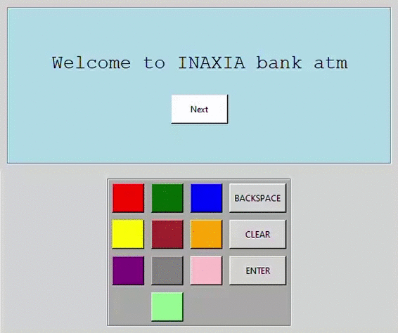

# Secure ATM
This project is made to make **Automated teller machine** more secure. It's simple nowadays to get your pin using hidden cameras, false keyboards, etc. So, here we are with a different idea to let your pin secure.

## Steps to Run
1. Fork this Repo
2. Clone that forked repo into your local system
3. Install `tkinter` library 
4. Run the code

Ignore the errors and warnings, it won't bother you
- Correct Atm id: **2020**
- Correct Pin: **6344**

## Youtube Demo video
# https://youtu.be/UuKt6rzu5Bo

## Presentation 
# [Presentation](https://www.canva.com/design/DAEOyTF6q9U/28OHlkQtcUmQJAk1UGaZug/view?utm_content=DAEOyTF6q9U&utm_campaign=designshare&utm_medium=link&utm_source=sharebutton)

## Demo video

# Thank You